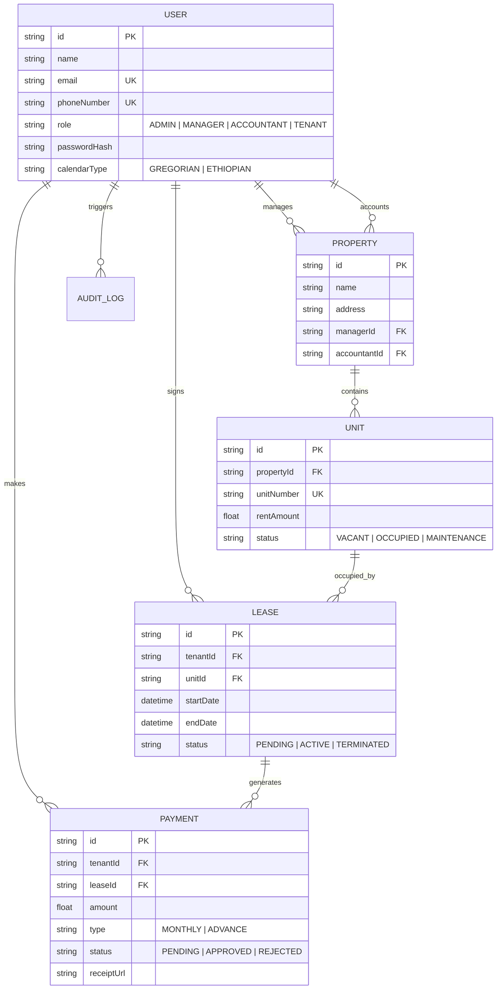

# NexusPMS | Institutional Portfolio Management System

NexusPMS is a high-density, professional-grade Property Management System designed for large-scale institutional real estate portfolios. Built with Next.js 16 and Prisma, it offers a robust suite of tools for administrators, managers, and accountants to streamline operations from tenant onboarding to financial reporting.

## 🚀 Core Features

### 🏢 Property & Inventory Management
- **High-Density Dashboards**: Real-time analytical views of occupancy, revenue trends, and unit availability.
- **Strict Data Integrity**: Enforced unique unit constraints per property to prevent inventory duplication.
- **Dynamic Access Control**: Assign Managers and Accountants to specific properties for data isolation.

### 👥 Tenant Lifecycle
- **Minimalist Enrollment**: A streamlined, 4-step onboarding workflow for new residents.
- **Automated Credentialing**: Instant user account generation for tenants upon registration.
- **Flexible Documentation**: Support for optional/delayed lease agreement uploads.

### 💰 Financial Management
- **Billing Intelligence**: Automated monthly and advance payment tracking.
- **Verification Workflow**: Accountant-driven approval process for payment receipts.
- **Multi-Bank Integration**: Manage multiple institutional accounts for payment routing.

### 🌍 Localization & Infrastructure
- **Dual Calendar Support**: Native support for both **Gregorian** and **Ethiopian** calendar systems.
- **Dynamic Currency**: System-wide currency settings configurable via the administrative panel.
- **Hybrid Storage**: Support for local or **FTP Remote Storage** for receipts and legal documents.
- **Global Messaging**: Integrated **SMS Ethiopia** and SMTP support for system notifications.

## 🛠 Tech Stack

- **Framework**: [Next.js 16 (App Router)](https://nextjs.org/)
- **Runtime**: Node.js 20+
- **Database**: [Prisma](https://www.prisma.io/) with [Better-SQLite3](https://github.com/WiseLibs/better-sqlite3)
- **Authentication**: [NextAuth.js v5 (Beta)](https://authjs.dev/)
- **UI Components**: [Shadcn UI](https://ui.shadcn.com/) & [Tailwind CSS 4](https://tailwindcss.com/)
- **Icons**: [Lucide React](https://lucide.dev/)

## 📊 Database Design

The system utilizes a relational schema optimized for multi-role property management:



## ⚙️ Infrastructure Configuration

NexusPMS supports advanced infrastructure settings for enterprise stability:

- **SMTP Verification**: Integrated test suite for mail server connectivity.
- **FTP Remote Storage**: Toggleable remote file storage with public base URL mapping.
- **SMS Integration**: API connectivity for Ethiopian-specific communication channels.
- **Factory Reset**: Administrative tools for safe system purification while preserving staff accounts.

## 🛠 Development

### Prerequisites
- Node.js 20.x or higher
- npm 10.x or higher

### Installation
1. Clone the repository:
   ```bash
   git clone https://github.com/your-repo/pms.git
   ```
2. Install dependencies:
   ```bash
   npm install
   ```
3. Sync database:
   ```bash
   npx prisma db push
   ```
4. Start development server:
   ```bash
   npm run dev
   ```

---
© 2026 Nexus Portfolio Management System. Built for Institutional Excellence.
